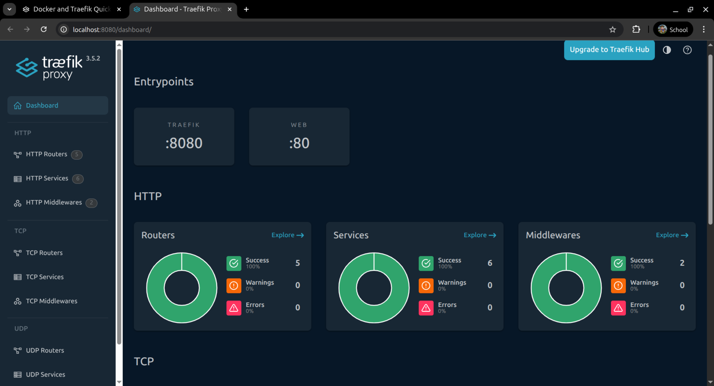

### Taller traefik

## Integrantes:
  - Julian Bayona
  - Camilo Ramirez

# ¿Qué ventajas tiene enrutar por host vs por puerto? 
El enrutamiento por host ofrece URLs más fáciles de entender como por ejemplo `api.miapp.com` en vez de miapp.com:8080, simplifica la gestión de seguridad al usar únicamente los puertos estándar `80/443`, facilita la configuración de certificados `SSL/TLS`, mejora la escalabilidad permitiendo agregar nuevos servicios `sin abrir puertos adicionales`, y proporciona **mejor experiencia de usuario** al evitar URLs con números de puerto que pueden ser bloqueadas por proxies corporativos o resultar confusas para los usuarios finales.

# ¿Qué diferencia hay entre labels en los servicios y usar archivos de configuración?
Los labels en servicios proporcionan `configuración dinámica` donde cada servicio define `su propio enrutamiento` directamente en el docker-compose.yml, siendo ideal para microservicios y desarrollo porque los cambios se aplican automáticamente sin reiniciar Traefik, mientras que los archivos de configuración ofrecen un `enfoque centralizado y estático con mayor control granular`, siendo más adecuados para configuraciones complejas de producción donde se requiere separación de responsabilidades y configuración avanzada, aunque requieren reiniciar Traefik para aplicar cambios.

# ¿Cómo se entera Traefik que habia nuevos servicios?
Traefik se entera de los servicios nuevos a través de `providers` que monitorean continuamente diferentes fuentes de datos. En el caso de Docker, Traefik usa el Docker Provider que se conecta al socket de Docker `/var/run/docker.sock` y escucha eventos en tiempo real como container start, container stop, y container update. Cuando un contenedor se inicia con labels de Traefik (como traefik.enable=true), Docker emite un evento que Traefik detecta inmediatamente, lee los labels del contenedor, genera automáticamente la configuración de enrutamiento correspondiente y actualiza sus rutas sin necesidad de reiniciar, permitiendo así el auto-descubrimiento dinámico de servicios.

---
 Versión de docker y docker compose

 Docker-compose.yml para traefik

 ejecutamos nuestro docker-compose para levantar los servicios
 Observamos el estado de nuestros contenedores

 
 Probando Traefik localmente

 Agregando el archivo whoami.yml para la aplicación de prueba

 Levantamos el servicio de whoami

 Acceso a la aplicación de prueba

 Evidenciamos que en nuestros HTTP Routers tenemos whoami.localhost.

 Evidenciamos que en nuestros HTTP Routers tenemos whoami.localhost.
